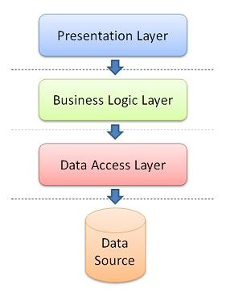

#   Week 3:  Java Servlets, JSP, JDBC  
3 days of class session and daily exercises  
2 days of miniproject recapping the learning objectives from the last 3 weeks

## Day 1 - Java Servlets
  
- The architecture (client server with HTTP, POST and GET)
  - Look at dev. tools. i chrome to see what is communicated between client and Server.
- The anatomy of a java servlet
  - DoPost() and DoGet()
  - ProcessRequest() - run through the template
    - PrintWriter
    - getContextPath
  - HttpServletRequest and HttpServletResponse objects
- The usefull methods
  - Demo getting data from userform to java console
    - request.getParameter(String) to get data from user form
- The session object.

## Exercise day 1 - 
Create an application that can register recipes from users

- Create an html form to get ingredients from the users
  - Let the form be dynamic so that the user can get input field for each ingredient
  - Also a text area for the howto of the recipe
- Collect the data on the server in a data collection (Must be static since HTTP is stateless)
- Create a toString method to show the content in a formattet way in the console.

## Day 2 - JSP (Java Server Pages)

- Architecture
  - Page Controller vs. Front Controller
- Setup a front controller example
  - use `<hidden>` form fields to communicate origin.
- 

## Exercise day 2
Continue from the exercise yesterday.

- Create a jsp page that can show all the recipes by name in a formatted user friendly manner.
- Make all the recipes clickable. Use a get request to tell server what recipe was clicked.
- Create a jsp page that can show a single recipe when it was clicked from the previous page
- Create a button in the the recipe details page that loads the recipe into form elements so data can be edited.

## Day 3 - JDBC - connection the application to database
- Persistence
- Setup JDBC driver
- Create working example with database connection
- Move data up and down between java collection and the database
- Get data from the db to show to user in html table
- Get data from user form and persist in db
- Setup example on how to upload picture to server and persist path in db
- ORM 

## Exercise day 3 - 
Continue from the exercise the two past days

- Now persist the data from the recipes website into db.
- Store pictures of the dishes in an img folder
- in db let each recipe have path to the image of the dish
- read the data from the db to show in jsp pages created earlier
- if there´s time: create a picture upload button on each recipe
  - when clicked the user should be able to upload additional images
  - these additional images should be shown too when the recipe is requested.

## CA1 - Fully implemented web application
[Create a web shop with Cupcakes ](Webshop.pdf)

- Create a database
- Add tables like user, invoice, orderline, bottom, topping
- Create JSP, CSS, Bootstrap, JS files for structure.
- Create Servlet to handle request and response from client to server
- Create Database Connection Class
- Create Entity classes
- Create mapper classes
- Create use cases for the app
- Create Database Facade class (based on use cases)
- Decide which jsp pages are needed for communicating with user
  - login, products page, order page, page of invoices.
- create js functions to create order and check users finances
