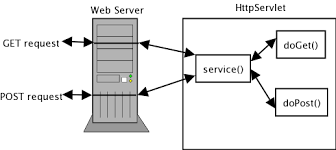
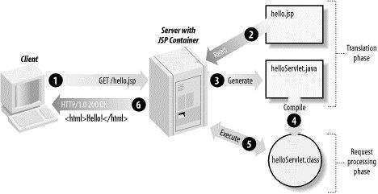

# 3rd week of the 2nd semester
Topics: HTTP, java servlet, jsp, JDBC

##Day 1: Java Servlet
We will look at how to setup a java web project using Tomcat server. 
How to use java servlets to utilize the HTTP protocol to get data from client to server and back. 
Also the Session concept will be covered.   


##Day 2: JSP
We will look at how to use JSP pages together with http servlets in order to communicate data from the application.  JSP will be the GUI that we use to get information from the user and give back information to the user.  
We will look at how to create dynamic html by using jsp with data collections.  We will be using scriptlets:  
```
<%
out.println("Your IP address is " + request.getRemoteAddr());
%>
```
in our jsp pages.  
For a [good tutorial on JSP click here](http://www.tutorialspoint.com/jsp/index.htm)    


##Day 3: JDBC
We will now incorporate a mysql database into our web application. We will look at the different methods that we can use to work with the database to fetch data and to insert data.  
We will look at all 4 CRUD operations and also on some basic principles for Object Relational Mapping (ORM).  
We shall look at the Facade Pattern as we decide on an architecture for our application.  


##Day 4,5 (6 and 7)
The final days of our first module we will use all the newly developed skills and create a full web application.  The application we will create is a web shop selling cup cakes.  
Features of the application will embrace:   

- user login
- database with multiple tables
- data mappers
- entity classes
- HTML form components
- javascript to calculata price and give warnings
- etc..
For at full description see [Project Description](Webshop.pdf)
